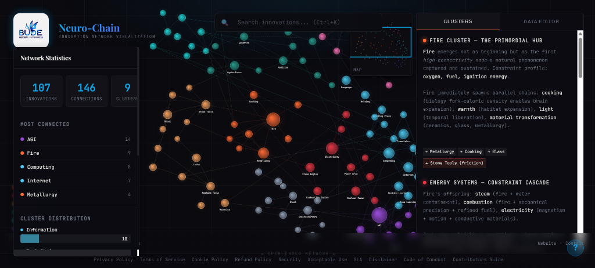

# Bude Global Neuro-Chain (创新神经链)

简体中文 | [English](./README.md)

**创新网络可视化平台**

将人类创新历程呈现为一个非线性网络，直观展示从“火的发现”到“通用人工智能 (AGI)”的技术演进与共生关系。本项目由 Bude Global 提供技术支持。



## 🌟 关于 Bude Global

Bude Global 专注于复杂创新网络与技术依赖关系的可视化。该 Neuro-Chain 平台展示了我们将数据转化为直观、交互式视觉体验的能力。

## 🚀 核心特性

- **智能搜索**：支持节点实时搜索，并伴有平滑的镜头聚焦效果。
- **像素级还原**：1:1 还原原始 HTML 实现的视觉细节。
- **数据驱动**：所有创新数据均通过 JSON 文件独立管理，易于编辑。
- **交互式画布**：支持平移、缩放，自由探索创新网络。
- **实时数据编辑器**：可在线直接编辑节点、边缘、集群信息及描述。
- **性能优化**：采用 React 记忆化（Memoization）技术与高效渲染引擎，可支持 10,000+ 节点。
- **纯静态部署**：无需服务器后端，可部署在任何托管平台。
- **SEO 友好**：完整的元标签（Meta Tags）配置，优化搜索引擎及社交媒体分享体验。
- **移动端适配**：针对各种屏幕尺寸进行了响应式优化。

## 📦 安装与运行

```bash
# 克隆仓库
cd bude-global-neuro-chain-react

# 安装依赖
npm install

# 启动开发服务器
npm run dev

# 构建生产版本
npm run build

# 预览生产版本
npm run preview
```

## 🏗️ 项目结构
```
bude-global-neuro-chain-react/
├── public/              # 静态资源
├── src/
│   ├── components/      # React 组件
│   │   ├── CanvasNetwork.jsx  # 网络画布
│   │   ├── TitleBlock.jsx     # 标题栏
│   │   ├── Legend.jsx         # 图例
│   │   ├── Panel.jsx          # 面板
│   │   ├── ClusterView.jsx    # 集群视图
│   │   ├── DataEditor.jsx     # 数据编辑器
│   │   ├── Controls.jsx       # 控制控件
│   │   └── Tooltip.jsx        # 悬浮提示
│   ├── data/            # JSON 数据文件
│   │   ├── clusters.json      # 9 大集群定义
│   │   ├── nodes.json         # 78 个创新节点
│   │   ├── edges.json         # 113 条连接关系
│   │   └── descriptions.json  # 集群详细描述
│   ├── styles/          # CSS 样式模块
│   │   ├── global.css
│   │   └── components/
│   ├── App.jsx          # 主应用入口
│   └── main.jsx         # 渲染入口
├── vite.config.js       # Vite 配置
└── package.json         # 项目配置
```

## 📊 数据架构

### clusters.json
```json
{
  "cluster_id": {
    "color": "#十六进制颜色",
    "label": "显示名称"
  }
}
```

### nodes.json
```json
[
  {
    "id": "唯一ID",
    "label": "显示标签",
    "cluster": "所属集群ID",
    "x": 0,
    "y": 0,
    "size": 16
  }
]
```

### edges.json
```json
[
  {
    "source": "源节点ID",
    "target": "目标节点ID",
    "type": "forward (正向)" | "backlink (回溯)"
  }
]
```

## 🎮 操作指南

- **鼠标拖拽**：平移画布。
- **鼠标滚轮**：放大/缩小视图。
- **悬停节点**：显示详细信息的提示框。
- **点击图例**：快速聚焦至特定集群。
- **⟲ 按钮**：重置视角至初始状态。
- **⏸/▶ 按钮**：暂停或恢复动画效果。
- **↓ 按钮**：将所有数据导出为 JSON 文件。

## 🎨 自定义配置

### 添加新节点

1. 打开右侧面板中的 **Data Editor** 选项卡。
2. 从下拉菜单选择 `nodes.json`。
3. 按照 Schema 格式添加你的节点数据。
4. 点击 **"Apply Changes"** 应用修改。

### 编辑集群描述

1. 打开 **Data Editor** 选项卡。
2. 选择 `descriptions.json`。
3. 编辑 HTML 内容（系统会自动进行安全过滤）。
4. 点击 **"Apply Changes"**。

### 更改颜色

编辑 `clusters.json` 并且修改 `color` 的十六进制编码。

## 🚢 项目部署

### Cloudflare Pages

```bash
npm run build
# 将 dist/ 目录上传至 Cloudflare Pages
```

### Netlify

```bash
npm run build
# 通过 Netlify CLI 或拖放 dist/ 文件夹进行部署
```

### Vercel

```bash
npm run build
# 使用命令部署：vercel --prod
```

### GitHub Pages

```bash
npm run build
# 将 dist/ 文件夹推送到 gh-pages 分支
```

## 🔒 安全性

- ✅ 使用 **DOMPurify** 对 HTML 进行洗涤，防止 XSS 攻击。
- ✅ 严禁使用 `eval()` 函数。
- ✅ 符合**内容安全策略 (CSP)**，无内联脚本。
- ✅ 健壮的 **JSON 解析**逻辑（含 `try-catch` 捕获）。

## ⚡ 性能表现

- **记忆化 (Memoization)**：所有组件均使用 `React.memo` 优化。
- **高效查询**：利用 `Map` 实现 $O(1)$ 复杂度的节点查询。
- **渲染优化**：基于 `requestAnimationFrame` 的单循环渲染。
- **代码分割**：提取 Vendor 依赖包以加快首屏加载速度。

## 🧬 Neuro-Chain 模型理念

该可视化方案将“发明创造”视为一个**非线性网络**而非单纯的线性时间线：

- **正向链接 (Forward Links)**：代表直接的技术演进与依赖。
- **回溯链接 (Backlinks)**：代表反向的技术关联（以虚线表示）。
- **核心枢纽 (Hubs)**：高连接度的节点，如“火”、“电力”、“AGI”。
- **集群 (Clusters)**：按主题分组（能源、工具、生物、信息等）。
- **开放式结局**：AGI 导向未知的未来发明 ($\infty$)。

## 📝 开源协议

本项目采用 [MIT](LICENSE) 协议。

## 🌐 社区与灵感

- **在线演示**：[https://invent.budeglobal.in/](https://invent.budeglobal.in/)
- **加入社区**：[WhatsApp 群组](https://chat.whatsapp.com/JSa5qnGbqAE76DEav1KCK6)
- **灵感来源**：本项目受 Google DeepMind 纪录片 [《思维游戏》(The Thinking Game)](https://www.youtube.com/watch?v=d95J8yzvjbQ) 启发。
- **纪录片频道**：[The Thinking Game Film](https://www.youtube.com/channel/UC0SOuDkpL6qpIF1o4wRhqRQ)
- **开发者中心**：[Bude Global Community](https://www.budeglobal.in/community) - 查看更多项目与贡献者。

## 🙏 鸣谢

@aravind-govindhasamy